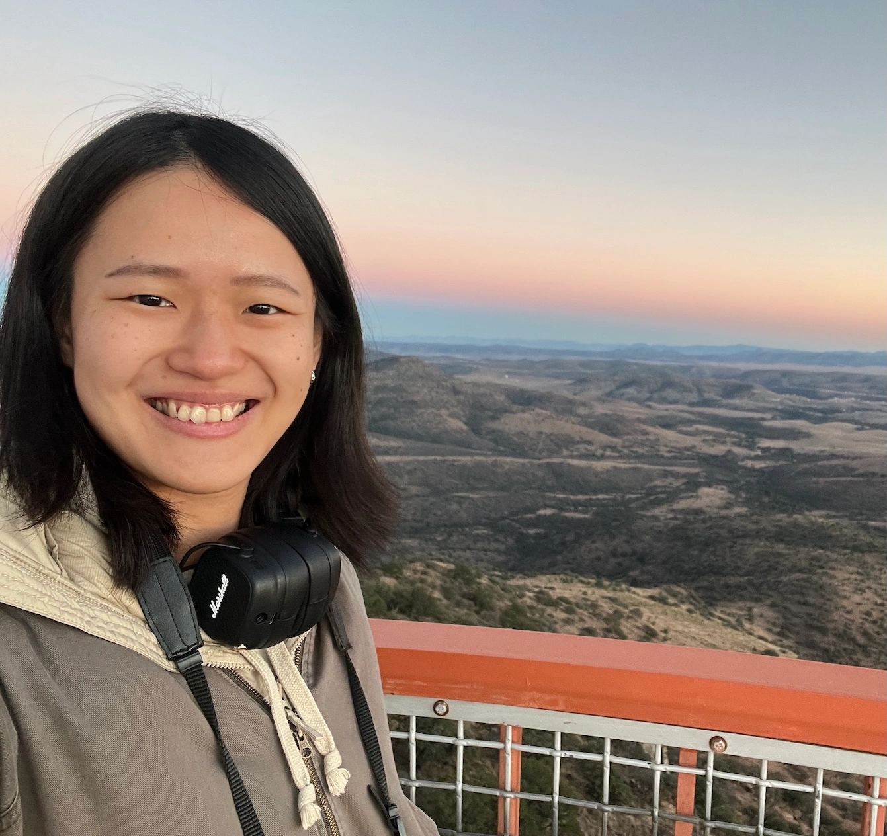

  <a href="/">Home</a>
  <a href="/research">Research</a>
  <a href="/cv">CV</a>
  <a href="/outreach">Outreach</a>

  
  
  

    
Hello! I am a graduate student in the <strong>Department of Astronomy at The University of Texas at Austin.</strong> My work focuses on how stars form and evolve in the Universe, supervised by Dr. Stella S. R. Offner.

    
I hold a M.S. degree from <strong>Institute of Astronomy, National Tsing Hua University</strong>, Taiwan, where I conducted astrophysical simulations of supernovae. At UT, my current project <strong>investigates the role of cosmic rays in star-forming clouds using <a href="https://starforge.space/" target="_blank" style="font-weight: bold; color: #bf5700;">STARFORGE</a> simulations.</strong>

    
I was born and raised in <a href="https://khh.travel/en/" target="_blank" style="font-weight: bold; color: #bf5700;">Kaohsiung</a>, a beautiful city in Southern Taiwan. And so was my dog, <a href="https://www.instagram.com/mumu_dog_0910/" target="_blank" style="font-weight: bold; color: #bf5700;">Mumu</a>! We moved to Austin together in the summer of 2024.

    
    

      <a href="https://scixplorer.org/public-libraries/7K4rh0uVRXaVBYfpganPeQ" target="_blank" 
        style="color: white; background-color: #bf5700; text-decoration: none; font-weight: bold; display: inline-flex; align-items: center; gap: 8px; padding: 10px 20px; border-radius: 50px; transition: background-color 0.3s, transform 0.2s; box-shadow: 0 4px 6px rgba(0,0,0,0.1);">
           
          Publications
      </a>

      <a href="https://github.com/hsinpeichen" target="_blank" 
        style="color: white; background-color: #bf5700; text-decoration: none; font-weight: bold; display: inline-flex; align-items: center; padding: 10px 20px; border-radius: 50px; transition: background-color 0.3s, transform 0.2s; box-shadow: 0 4px 6px rgba(0,0,0,0.1);">
          
          GitHub
      </a>

      <a href="mailto:hpchen@utexas.edu" target="_blank" 
        style="color: white; background-color: #bf5700; text-decoration: none; font-weight: bold; display: inline-flex; align-items: center; padding: 10px 20px; border-radius: 50px; transition: background-color 0.3s, transform 0.2s; box-shadow: 0 4px 6px rgba(0,0,0,0.1);">
          Email
      </a>

      <a href="https://www.name-coach.com/hsin-pei-chen-74e4f5c1-32b1-4295-a372-db0a15b96573" target="_blank" 
        style="color: white; background-color: #bf5700; text-decoration: none; font-weight: bold; display: inline-flex; align-items: center; gap: 5px; padding: 10px 20px; border-radius: 50px; transition: background-color 0.3s, transform 0.2s; box-shadow: 0 4px 6px rgba(0,0,0,0.1);">
          🔊 My Name
      </a>
    

  

  
© 2026 Hsin-Pei Chen | Last updated: Feb 2026

  
  

    <a href="mailto:hpchen@utexas.edu">Email</a> | 
    <a href="https://github.com/hsinpeichen" target="_blank">GitHub</a> | 
    <a href="https://scixplorer.org/public-libraries/7K4rh0uVRXaVBYfpganPeQ" target="_blank">Publications</a>
  

  

    All content is licensed under <a href="https://creativecommons.org/licenses/by/4.0/" target="_blank">CC BY 4.0</a> unless otherwise noted.
  

<a href="#" class="back-to-top" title="Back to Top">↑</a>