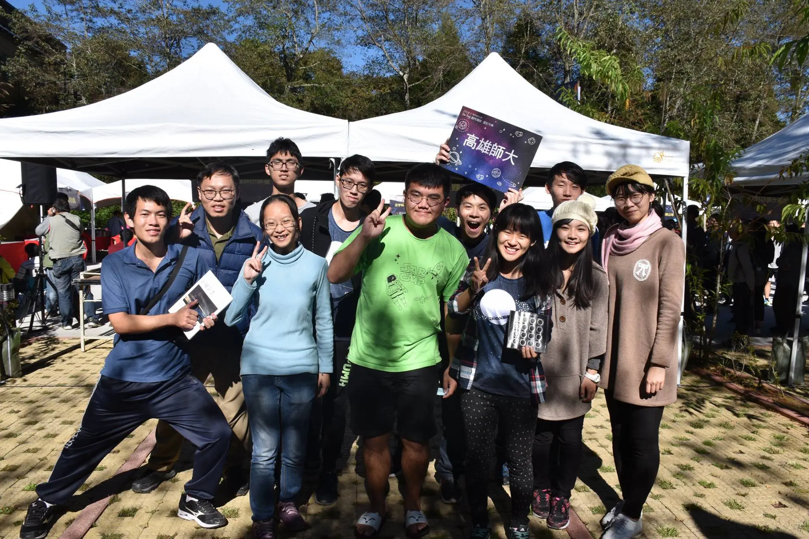
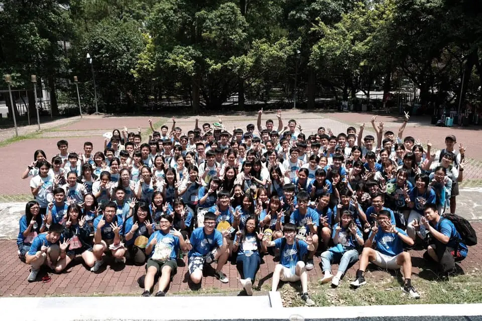
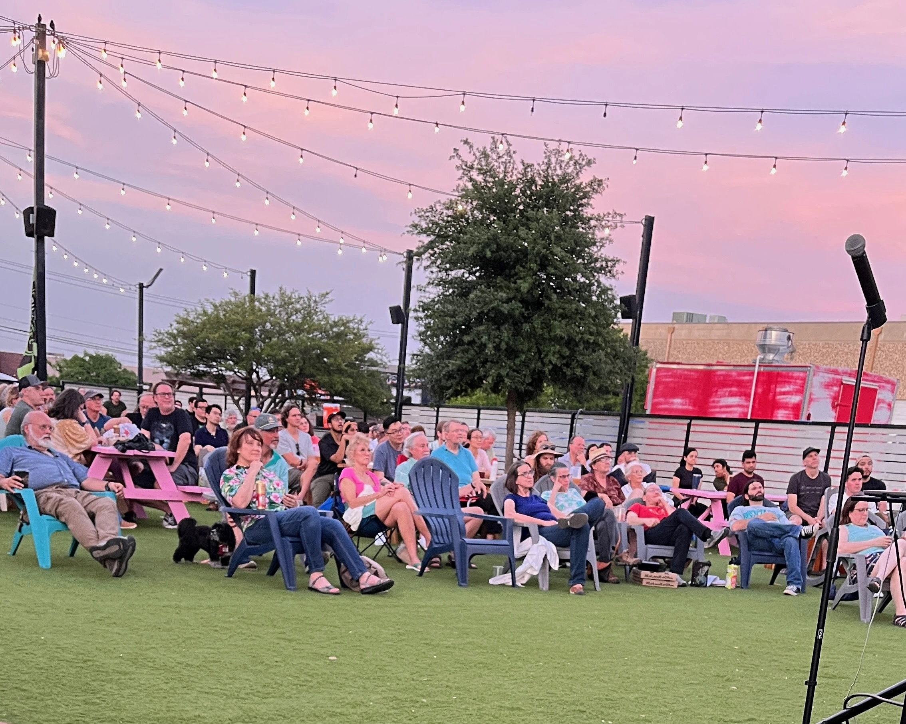

  <a href="/">Home</a>
  <a href="/research">Research</a>
  <a href="/cv">CV</a>
  <a href="/outreach">Outreach</a>

  

    Outreach
  

  

    
In addition to my academic pursuits, I have dedicated time to amateur astronomy clubs and activities in Taiwan, with the aim of sharing the wonders of the Universe with college students and the broader public.

    
    

    <h3>Astronomy Club Activities (2017-2020)</h3>

    

    

      I initiated the Astronomy Club at NKNU during my undergraduate years, recruited instructors and instrumental aids, and designed courses for astronomy and observation techniques. I also led the teaching segment at the NTHU StarKids Astronomy Camp, designed for high school students who are passionate about astronomy.
    

    

    <h3>Astronomy Club Union of Universities in Taiwan (2020-2024)</h3>

    

    

      During 2020-2022, I served as one of the directors at the Astronomy Club Union of Universities in Taiwan (ACUUT), an organization dedicated to supporting university astronomy clubs in Taiwan. Especially, during the solar eclipse in June 2020, I coordinated the national live-streaming program of ACUUT in collaboration with the Central Weather Bureau in Taiwan, ultimately attracting around 290,000 viewers. Through these experiences, I have acquired valuable skills in project organization, team leadership, and effective collaboration.
    

    

    <h3>Astronomy Club Union of Universities in Taiwan (2020-2024)</h3>

    

      

        
      

      

        
      

      

        
      

    

    

      During 2020-2022, I served as one of the directors at the Astronomy Club Union of Universities in Taiwan (ACUUT), an organization dedicated to supporting university astronomy clubs in Taiwan. Especially, during the solar eclipse in June 2020, I coordinated the national live-streaming program of ACUUT in collaboration with the Central Weather Bureau in Taiwan, ultimately attracting around 290,000 viewers. Through these experiences, I have acquired valuable skills in project organization, team leadership, and effective collaboration.
    

    

    <h3>Astronomy for the Public in Austin (2024-Current)</h3>

    

    

      As an international student who left my home country at the age of 26, I am currently learning to engage with the local community in Austin, TX by regularly attending Astronomy on Tap ATX events. My goal is to give at least one public talk before I graduate in 2029. Hopefully more!
    

  

  
© 2026 Hsin-Pei Chen | Last updated: {{ site.time | date: "%B %d, %Y" }}

  
  

    <a href="mailto:hpchen@utexas.edu">Email</a> | 
    <a href="https://github.com/hsinpeichen" target="_blank">GitHub</a> | 
    <a href="https://scixplorer.org/public-libraries/7K4rh0uVRXaVBYfpganPeQ" target="_blank">Publications</a>
  

  

    All content is licensed under <a href="https://creativecommons.org/licenses/by/4.0/" target="_blank">CC BY 4.0</a> unless otherwise noted.
  

<a href="#" class="back-to-top" title="Back to Top">↑</a>