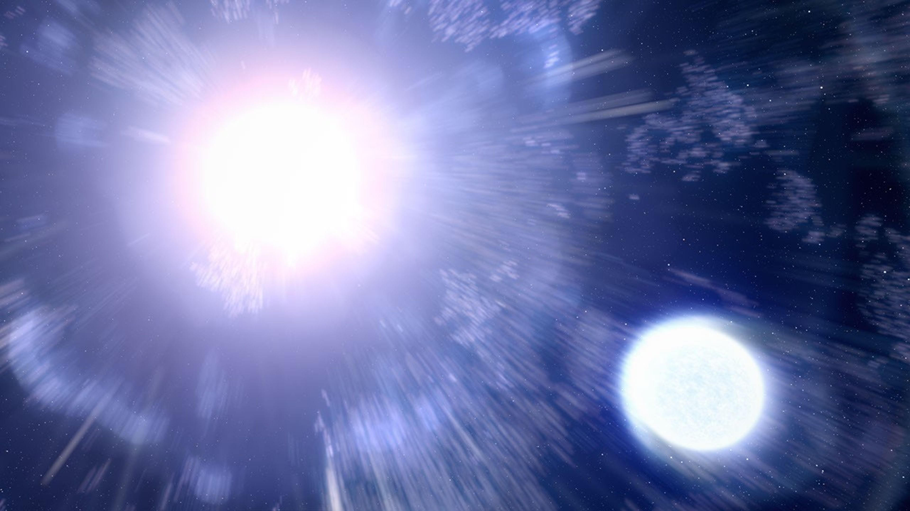
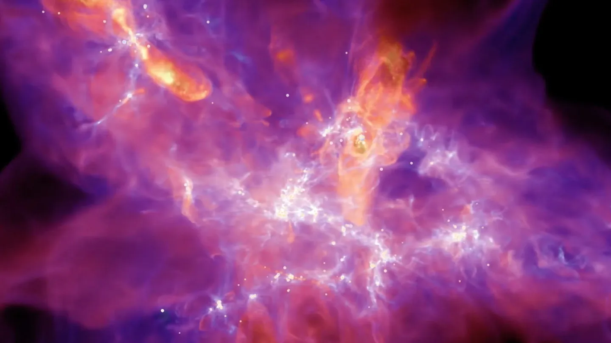

  <a href="/">Home</a>
  <a href="/research">Research</a>
  <a href="/cv">CV</a>
  <a href="/outreach">Outreach</a>

  

    Research Overview
  

  

    
    <h3>Master's Thesis: Exploring the Observability of Surviving Companions of Stripped-envelope Supernovae</h3>

    
    
Image credit: NASA, ESA, Leah Hustak (STScI)

    

      In 2020, I began my Master’s studies at NTHU, under the guidance of Dr. Kuo-Chuan Pan. My Master's thesis focused on simulating the surviving companions of stripped-envelope supernovae (SNe). Through hydrodynamics simulations of the SN impact on the companion and the evolutionary paths of the surviving companion, we uncovered that the surviving companion becomes temporarily brighter and redder, enhancing the chances of detection. By applying observational constraints from SN 2020oi, we further predicted that the possible surviving companion could be observed by Hubble Space Telescope (HST) and James Webb Space Telescope (JWST) 10 years after the explosion. This project was published in the Astrophysical Journal (Chen, Rau, & Pan, 2023) and featured in the <a href="https://aasnova.org/2023/07/19/wanted-surviving-companions-of-stripped-envelope-supernovae/" style="color: #bf5700; font-weight: bold;">AASNova</a> website in July 2023.
    

    <a href="https://iopscience.iop.org/article/10.3847/1538-4357/acc9af" class="paper-btn" target="_blank"> View Paper
    </a>

    

    <h3>Research Assistant Project at NCTS: Type Ia Supernova Progenitors and Surviving Companions within the Symbiotic Channel</h3>

    

    

        <iframe 
        src="https://www.youtube.com/embed/QSmuqBiAQ4c" 
        style="position: absolute; top: 0; left: 0; width: 100%; height: 100%; border: none;" 
        allow="accelerometer; autoplay; clipboard-write; encrypted-media; gyroscope; picture-in-picture" 
        allowfullscreen>
        </iframe>
    

    

        NASA video (1:20) explaining the single-degenerate scenario of Type Ia supernovae.
    

    

    

      After graduating in February 2023, I continued working as a Research Assistant at the National Center for Theoretical Science in Taiwan under the mentorship of Professor Pan. I embarked on my next project, exploring the systematic study of surviving companions in the symbiotic channel of type Ia supernovae. Our research revealed that the evolved companions could maintain their luminosity from before the SN explosion or transform into hot, bright dwarves. We have submitted the paper to ApJ, and it is currently under revision. Through these projects of simulations of supernovae, I have received solid training in conducting simulations using stellar evolution code MESA and hydrodynamics simulation code FLASH, and also have enhanced my abilities in problem solving, literature review, and scientific writing.
    

    <a href="https://iopscience.iop.org/article/10.3847/1538-4357/adeb71" class="paper-btn" target="_blank"> View Paper
    </a>

    

    <h3>Current Project at UT: Synthetic Observations of Cosmic Ray Tracers with STARFORGE Simulations</h3>

    
    
Image credit: Northwestern University/UT Austin

    

      Currently at UT Austin, as a member of Dr. Stella Offner's research group, my first two years of graduate study are dedicated to investigating the effects of cosmic rays in star-forming regions. Cosmic rays are a significant factor influencing various aspects of star formation, including chemical abundances, gas temperature, and star formation efficiencies. In this project, I will use numerical simulation data from STARFORGE (Fitz Axen et al. 2024) to examine how cosmic rays affect chemistry of star-forming clouds. My goal is to produce synthetic observations of cosmic ray tracers and to evaluate the accuracy of the CRIRs derived in molecular cloud observations.
    

  

